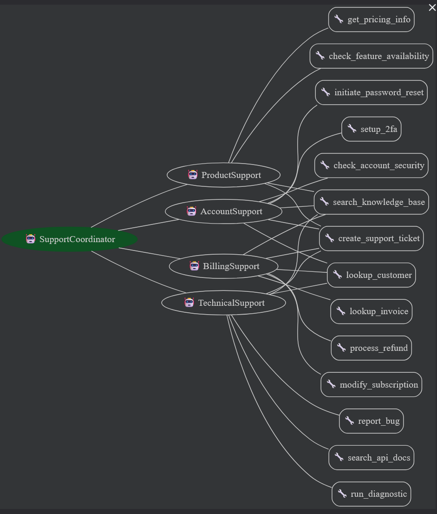

# PATUREAU Romain : Classifieur de requête d'utilisateur

## Description
Ce projet sert à analyser la demande de l'utilisateur, par un agent coordinateur, et l'envoyer à un agent spécialisé dans le domaine nécessaire pour réaliser cette demande. L'agent spécialisé traite la demande avec les outils à sa disposition, et envoie un message de recommendation à l'agent coordinateur qui va renvoyer le message à l'utilisateur.

## Architecture système


## Instructions de lancement
1. Télecharger/cloner le repositoire
2. Créer et activer un environnement virtuel :
```cmd
python -m venv venv
venv\Scripts\activate
```

3. Installer les dépendances du projet
```cmd
pip install -r requirements.txt
```

4. Lancer la version web de google_adk
```cmd
adk web --port 8000
```

5. Naviguer vers le lien indiqué par l'éxecution de la ligne de commande précédente
6. Sélectionner l'agent "coordinator_agent"

Vous pouvez désormais effectuer des requêtes vers les agents

## Requêtes de test
1. Comment réinitialiser mon mot de passe ? Mon email est john.doe@gmail.com
2. 